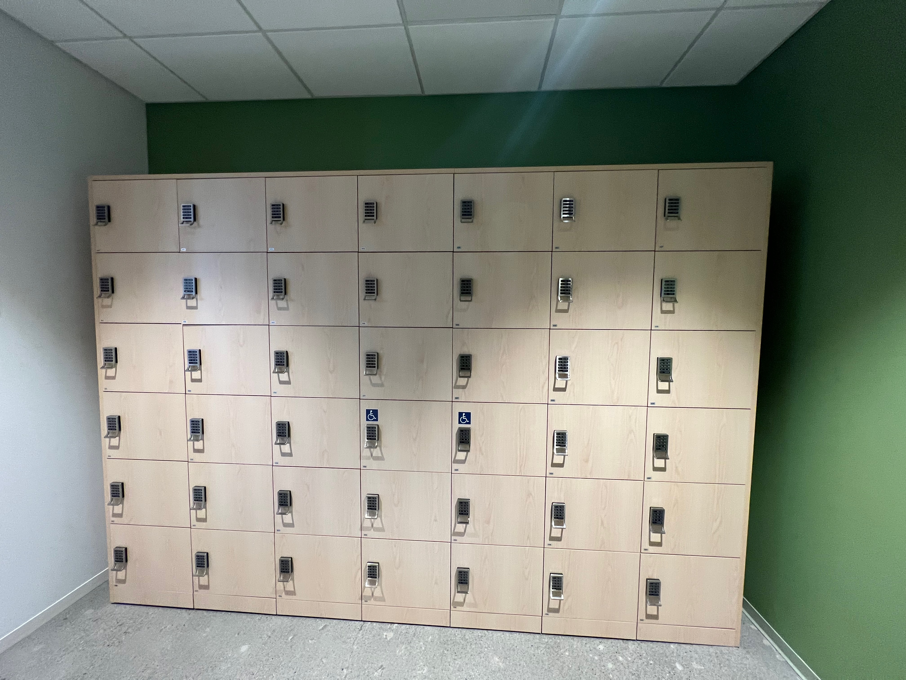

# Getting started - Solving algorithm puzzle of distributing swag items - Visual Studio Code

Welcome to GitHub Copilot!

Probably not too surprisingly, GitHub Copilot is very good at solving algorithm puzzles. In this demo, we will show how GitHub Copilot can actually helped to solve a real problem -- distributing swag items to lockers.

Here is a story. We have a number of different swag items to distribute to some employees as a part of appreciation. Now, we have some tumbers, bag packs, shirts of different sizes, and hoodies of different sizes. The problem is that we want to put these on lockers so it can be sort of self-service based where each person can walk up to a locker, type in a passcode, and can take out a bundle of swag items. The problem is that passcode for each locker has to be unique -- consisting for 4 digits. So, we need to figure out how to distribute these swag items to lockers so that each locker has a unique passcode.

## Prerequisites

- [Copilot Extension for Visual Studio Code](https://code.visualstudio.com/download)
- Python

## Steps

